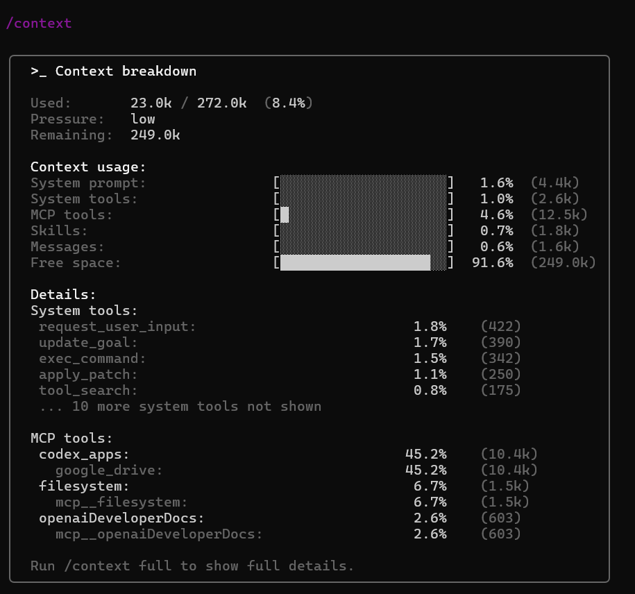
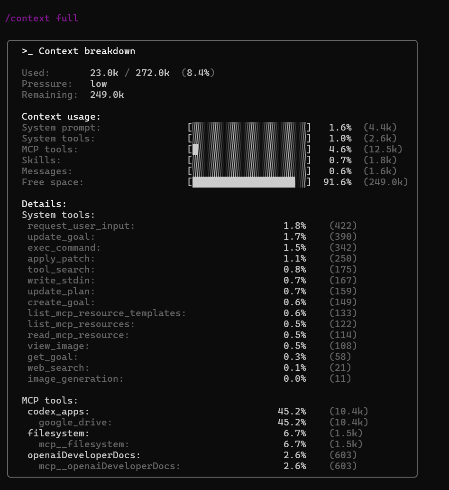

# Native /context usage breakdown

This branch adds a read-only `/context` command to the Codex TUI for inspecting how the current context window is being used.

The root `README.md` is intentionally kept aligned with the upstream Codex project. This document only describes the context usage feature added in this branch.

## What it shows

The context usage card shows the current context window composition across:

- System prompt
- System tools
- MCP tools
- Skills
- Messages
- Free space

## Commands

```text
/context
/context full
```

`/context` shows a compact default view.

`/context full` shows a fuller breakdown with more detail.

## Screenshots

### Compact view



### Full view



## Scope

This feature is intended as a read-only inspection surface.

It does not change:

- request construction
- conversation history
- provider-side usage accounting
- rate limit behavior
- context compaction behavior
- tool or skill injection policy

The command should not mutate the live session or change the next request.

## Implementation summary

The implementation adds native context usage bucket accounting and TUI rendering for a dedicated `/context` command.

The top-level context window composition includes system prompt, system tools, MCP tools, skills, messages, and free space.

The feature supports compact and full display modes, while keeping the UI aligned with Codex TUI conventions.

## Validation

This branch keeps the upstream-facing feature focused on the native implementation, in-repo tests, and TUI snapshots.

Recommended local checks include:

```bash
cd codex-rs

cargo fmt -- --check
cargo test -p codex-tools skill -- --nocapture
cargo test -p codex-tools validates_native_breakdown_against_serialized_request_tools -- --nocapture
cargo test -p codex-tui context_breakdown_card_groups_tools_and_keeps_messages_aggregate -- --nocapture
cargo test -p codex-tui slash_commands -- --nocapture
CARGO_BUILD_JOBS=2 cargo build -p codex-cli --bin codex
```

## Related upstream proposal

This branch is related to the upstream Codex feature request:

openai/codex#27898
